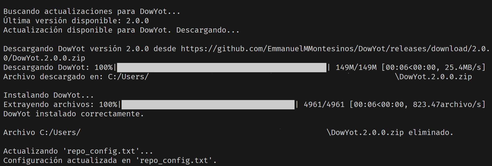

# **UpdateApp**



`UpdateApp` es un paquete/script diseñado para simplificar la tarea de mantener actualizados tus repositorios favoritos (ya sean propios o de terceros) alojados en GitHub. Proporciona dos formas de uso:
1. Como una clase importable para integrar en tus propios proyectos.
2. Como un script autónomo que utiliza un archivo de configuración (`repo_config.txt`) para actualizar aplicaciones.

---

## **Características**
- Verificación automática de actualizaciones en los repositorios de GitHub.
- Descarga de la última versión disponible utilizando los assets del repositorio.
- Instalación automática con barra de progreso para extracción de archivos ZIP.
- Uso flexible: como clase en tus proyectos o como script CLI.

---

## **Requisitos**
- Python 3.8 o superior.

### **Instalación de dependencias**
Las dependencias necesarias están incluidas en el archivo `requirements.txt`. Instálalas ejecutando:

```bash
pip install -r requirements.txt
```

## **Uso**

### **1. Como clase importable**

Puedes integrar la clase `UpdateApp` directamente en tu proyecto. A continuación, un breve tutorial de cómo hacerlo:

#### **Ejemplo básico**

```python
from update import Update_App

# Configura tu aplicación
update_app = UpdateApp(
    name_app="MiAplicacion",
    version_app="1.0",
    url_repository="https://github.com/usuario/repo"
)
```
Actualiza tu aplicación si hay una nueva versión
update_app.update()

### 2. Como Script CLI
Puedes usar el archivo update.py como un script independiente para actualizar aplicaciones. Para ello, necesitas un archivo de configuración llamado repo_config.txt en la misma carpeta que el script. Este archivo debe tener el siguiente formato:

```txt
name_app-Nombre de la aplicación
version_app-Versión actual de la aplicación
url_repository-URL del repositorio de GitHub
```

Para ejecutar el script:
```bach
python update.py
```
Si hay una nueva versión, el script la descargará, descomprimirá y eliminará automáticamente el archivo ZIP descargado.

## **Cómo Funciona**

### **Flujo de actualización**

1. **Verificar actualizaciones**:  
   Comprueba si la última versión publicada en el repositorio de GitHub es diferente de la actual.

2. **Descargar la última versión**:  
   Descarga el archivo ZIP más reciente de los assets.

3. **Instalar la nueva versión**:  
   Extrae el archivo ZIP en el directorio actual con una barra de progreso.

---

### **Funciones principales**

- `check_update()`: Verifica si hay una nueva versión disponible.
- `download_latest()`: Descarga la última versión disponible.
- `install(path_new_version)`: Extrae el archivo ZIP descargado y elimina el archivo temporal.

---

## **Notas**

- Asegúrate de que el repositorio de GitHub tenga un release publicado con un asset válido.
- Si usas el script, el archivo `repo_config.txt` debe estar correctamente configurado.
- La barra de progreso utiliza `tqdm` para mostrar el estado tanto de la descarga como de la extracción.

---

## **Problemas comunes**

### **Error al buscar actualizaciones**

Asegúrate de que la URL del repositorio sea válida y accesible.

### **Asset no encontrado**

Verifica que el release del repositorio tenga al menos un archivo adjunto como asset.

---

## **Contribuciones**

Si tienes ideas o encuentras problemas, ¡no dudes en abrir un issue o enviar un pull request!
